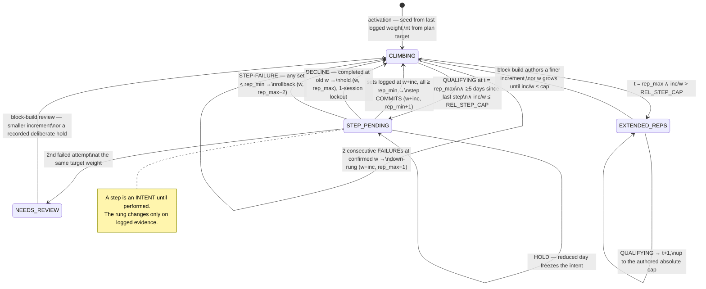

# Automatic Progression Rule — Design (P5)

*Status: **DESIGN ONLY** — approved shape for the post-2026-08-16 block build. No code
implements this yet. Written 2026-08-10. The athlete's brief: after 3 consecutive
sessions of an exercise at the same working weight, progress the load automatically
rather than waiting for a decision, with the full per-set prescription visible
**before the first rep**. Deterministic throughout — no AI anywhere in the decision
path (Key Rules 1/2; docs/resume.md "The Hard Boundary").*

---

## 1. Context and scope

The app already half-does this, and the half matters:

- `engine.double_progression` (services/engine.py:317) is live: when every set of the
  **last** session hits `rep_max`, weight steps by the per-exercise increment and reps
  reset to `rep_min`. But only 4 of 11 loaded lifts carry `rep_min`/`rep_max`
  (Goblet Squat, Incline DB Press, Face Pull, Pallof Press). **Lat Pulldown and all of
  Session B are invisible to it** — they move only on the ±1-increment readiness nudge
  (`suggested_weight_kg`) or the plan's hard-coded weekly kg ladders
  (`pulldown_kg = {1: 25.0, 2: 27.5, ...}`), which end with the block.
- The autoregulation layer this design must be subordinate to is the **LOAD
  RESOLUTION** order at services/sessions.py:500-541, written 2026-08-06 after the app
  proposed 45 kg → 47.5 kg on a day the banner said "reduced load":
  *progression PROPOSES, autoregulation CLAMPS.* `load_policy()` decides once whether
  today is reduced; `clamp_to_ceiling()` moves numbers down only;
  `assert_within_ceiling()` raises `PrescriptionContradiction` if the final numbers
  violate the policy. There is no written spec beyond that code — the code is the spec,
  and this design changes none of it.

**In scope**: straight-rep loaded lifts — `type == "reps"` AND
`equipment_type ∈ {dumbbell, cable, plate}` AND `weight_kg is not None`.
**Out of scope**: bands (the tier ladder stays on `suggested_band_tier` — a band is
not a kilogram), holds and durations (hold length is a prescription decision the
physio holds the pen on — see the pending §14 micro-dose questions), and
**Prone Y-Raise specifically**: it is `hold_reps` *with* a dumbbell, so the equipment
check alone would wrongly include it; the `type == "reps"` conjunct is load-bearing.
`weight_kg = 0.0` reads as bodyweight, never as a decline. Bulgarian Split Squat
enters the machine only in the weeks it carries external weight.

---

## 2. Decision table — the eight questions, resolved

| # | Question | Decision |
|---|----------|----------|
| 1 | Trigger | A session counts when **all prescribed sets are completed at the working weight with reps ≥ target**, on an unreduced day, with the RPE and pain gates passing. Reduced days **pause** the streak; a single failure at an established weight **pauses**; failure at a just-stepped weight **rolls back**; skipped sessions don't break it; a **> 21-day gap** resets reps to the floor. |
| 2 | Increment | **Per-exercise kg**, via the existing `increment_size`/`increment_unit` fields, made explicit in a coverage-pinned table with per-entry why-strings. Guard: `REL_STEP_CAP` (25%, kg lifts only) diverts too-coarse steps into **extended-rep mode** instead of freezing the lift. Rep spans are authored per lift from a demand-neutrality formula. |
| 3 | Sets 2–3 at a step | **All sets move to the new weight together; reps reset to the floor.** The rep-floor reset *is* the adjustment of the remaining sets. No mixed/descending schemes. |
| 4 | Rep vs load axis | **Reps first**: target climbs +1 per qualifying session, weight frozen. At the ceiling, load steps and reps reset. Exactly one axis moves per session. |
| 5 | Autoregulation precedence | Unchanged and structural: the machine proposes **inside `seed_actual_entry`** (replacing the `double_progression` branch); the clamp chain runs after, downward-only. Reduced days freeze the machine. Progression can never override a downward clamp — `PrescriptionContradiction` remains the backstop. |
| 6 | Visibility & consent | **Mode (b): fully automatic**, surfaced prominently pre-session as an old-vs-new per-set table. The ± steppers are the zero-friction veto; the set-complete tap is the consent; a step-down-and-complete is a **decline** with a 1-session lockout. Every held state carries a visible reason. |
| 7 | Rollback | Failure at the new weight → revert to the old weight at `rep_max − 2` (≥ 2 sessions before retry). **Two failed attempts at the same target weight** → `NEEDS_REVIEW`: hold, caption, block-build item. |
| 8 | Data | **No stored counter.** State derives from session history, anchored by a per-session **prescription snapshot** persisted on each exercise row. Rows without snapshots classify as inert. |

The rest of this document is the rationale and the exact rules.

---

## 3. The rung machine

### 3.1 State

Per exercise: `(w, t)` — working weight and rep target, `rep_min ≤ t ≤ rep_max` —
plus bookkeeping carried in the snapshot (`pending_step`, `fail_count`,
`decline_count`, flags). One axis moves at a time.

**A step commits only on performed evidence.** When `t` reaches `rep_max` and the
gates pass, the *next prescription* is `(w + inc, rep_min)` — an intent. The rung
itself becomes `w + inc` only after a session logs working sets at `w + inc`. Until
then the machine is `STEP_PENDING`, and a reduced day, a decline, or a failure each
resolve it differently (§3.3). This one sentence prevents three classification
ambiguities the adversarial review found: a decline is not a failure, a clamp is not
a decline, and "first session after a step" cannot be dodged by a rest day landing in
between.

### 3.2 Why "3 consecutive sessions at the same weight" is emergent, not counted

A rep span of 2 (e.g. 10 → 12) forces a minimum of **three qualifying sessions at
every weight**: one at the floor, one per intermediate rung, one at the ceiling. The
athlete's trigger is therefore satisfied *structurally* — there is no separate streak
counter to maintain, desynchronise, or reset.

Two deliberate properties fall out:

- **Overshooting never skips rungs.** The target is what advances, +1 per qualifying
  session, no matter how many reps were actually done. Doing 12 on a target-10 day
  confirms the session; it does not jump the ladder. For a Beighton 6/9 athlete whose
  connective tissue adapts slower than muscle (Baar annex §3.1: the growth signal is
  magnitude-insensitive — *heavy is not the point*), capping the rate of advance is
  the feature, not a limitation.
- **The minimum time-at-weight is tunable per exercise** by span width, which is how
  the block's fast-track/slow-track policy (training_plan.py:1754-1758) translates
  into the machine: narrow span = faster cadence.

### 3.3 Session classification (fixed order, replay-deterministic)

Each completed session is classified by the first matching rule. The order is part of
the design — two readers evaluating in different orders must be impossible.

1. **No snapshot** (row predates the feature, or synthetic `make_sets_data` history —
   identical rows, no per-set `ts`) → **HOLD**. Inert: never advances, never resets.
2. **Reduced / clamped / fallback** (`policy_reduced`, `clamped` non-empty, or
   `source == "fallback"` in the snapshot) → **HOLD**. The engine predicted
   underperformance, so underperformance that day is not evidence against the weight —
   and a clamp that held the proposal down must never read as the athlete declining.
   `DECLINE` additionally requires `final == proposed` (the athlete actually saw the
   real proposal and stepped off it).
3. **Fewer sets logged than prescribed** → **HOLD** (the `double_progression`
   short-session guard, kept: an absent set is not a completed set, and `all()` over a
   short list is vacuously true).
4. Compute `w_session` = weight of the **last working set**, after `round(x, 2)` —
   the same "never discard weight the athlete earned" precedent as
   engine.py:373-376. Mixed-weight sessions classify against `w_session`.
5. **`STEP_PENDING` and `w_session` = old `w`** → **DECLINE**. Regardless of reps —
   a declined weight says nothing about the rung. Effect: hold at `(w, rep_max)`,
   lockout of **one** session, then re-arm on the next qualifying session. One
   stepper tap is a cheap veto, so it earns a mild consequence — not the 3-week
   lockout a signed refusal would justify (contrast `scheduling.declined_entries`,
   which requires an explicit button press before it stops asking).
6. **`w_session` = the step weight `w + inc`**: any working set `< rep_min` →
   **STEP-FAILURE** (→ rollback, §3.5); all sets ≥ target → the step **commits** and
   the session advances (`t = rep_min + 1`).
7. **`w_session` = current `w`**: gates first — session RPE > the stage
   `rpe_ceiling`, or the check-in pain score **as of the session date** > 2, or the
   pain check-in missing → **HOLD with reason** (a measurement not taken is not
   evidence of health). Then: all sets ≥ `t` → **QUALIFYING** (`t + 1`, or arm the
   step at `rep_max`); any set `< rep_min` → **FAILURE** (§3.5); otherwise
   (completed, above floor, under target) → **HOLD**.
8. **All sets at a common other weight `w′`, reps ≥ `rep_min`** → **ADOPT**: the rung
   re-anchors to `(w′, clamp(min set reps, rep_min, rep_max))`. The athlete's manual
   step — up *or* down — outranks the machine, in both directions; ask-first cuts
   both ways here exactly as it does in scheduling. Without ADOPT, a voluntary jump
   to 17.5 kg would leave the machine re-proposing 15 kg forever — the stale-value
   bug `double_progression` was explicitly written to avoid.
9. Anything else → **HOLD**.

Gates only ever demote QUALIFYING to HOLD. They never manufacture a failure.

### 3.4 Step preconditions (beyond `t == rep_max`)

- **Calendar spacing: ≥ 5 days since this exercise's last committed step.** The
  machine is exposure-indexed, but the physio's rate rule is per calendar week
  ("keeping weekly increases under ~30% — the single biggest tendon mistake",
  physio_brief_2026-08-16.md §10). A manual swap (`manual_swap_entries`) can pull two
  exposures of one session into the same week; without this guard that is two steps
  in seven days. A spacing-suppressed step is a HOLD with its reason on screen.
- **`REL_STEP_CAP`: if `inc / w > 0.25`, no step** — instead the lift enters
  **extended-rep mode**: `t` may climb past `rep_max` up to an authored absolute cap
  (e.g. Bulgarian Split Squat 8 → 15), converting the too-coarse step into rep
  headroom, and the lift is flagged for block-build review (a finer increment, or a
  deliberate hold). This is an escape ladder, not a trapdoor: the earlier draft froze
  such lifts at `rep_max` permanently, which — with the readiness nudge and the
  weekly ladders both retired — would have left 2–3 of the 9 lifts with no
  progression path at all (Incline DB Press at 8 kg is over the cap: 2.5/8 = 31%).
  Applies to kg lifts only; "unit" machines (Face Pull, Pallof — conversion
  explicitly unmeasured, training_plan.py:87-89) get a flat one-unit step plus the
  spacing rule, because a percentage of an uncalibrated dial number is not a safety
  proxy.
- **Stale gap: > 21 days since the last exposure** → `t` resets to `rep_min` at the
  current `w` before proposing, captioned. Session-indexed streaks must not survive a
  layoff untouched (Baar §6.1: detraining is fast — measurable collagen loss in
  days); 21 days survives a reassessment week plus an illness week, not a month off.
  Revert condition, `HRV_GARMIN_HOLD` idiom: if this ever resets a streak the athlete
  judges still valid, re-examine the constant against the actual gap — on the
  measurement, not the complaint.

### 3.5 Failure, rollback, down-rung

- **STEP-FAILURE** (any set `< rep_min` at an *unconfirmed* weight — no prior
  non-failure completion there, however many HOLD days intervened): **rollback** to
  `(w, rep_max − 2)`, clamped ≥ `rep_min`. Re-entry two rungs down means at least two
  qualifying sessions before the retry — deliberate spacing for a re-attempt that
  already failed once.
- **Two failed attempts at the same target weight** — counted per target weight,
  regardless of intervening sessions, reset only by a confirmed completion at that
  weight — → **`NEEDS_REVIEW`**: the machine holds at the confirmed rung, the caption
  says the increment may be too coarse for this lift, and the flag surfaces at block
  build. Without the per-target-weight definition, the qualifying sessions between
  two failures would reset a naive "consecutive" counter and the fail–climb–fail
  cycle would oscillate forever.
- **FAILURE at an established weight** (confirmed rung): first one → **HOLD** (a bad
  day is context, not verdict); **two consecutive** → **down-rung**:
  `(w − inc, rep_max − 1)`, and a second down-rung raises `NEEDS_REVIEW`. Without
  this transition the failure side of the machine is an absorbing state: an athlete
  who can no longer hit `rep_min` at `w` would be prescribed `(w, rep_min)` forever,
  and for this athlete stalled-at-too-heavy is the clinically important direction.

### 3.6 State diagram



---

## 4. Increments and rep spans

### 4.1 The demand-neutrality formula (span-authoring rule)

By Epley (`e1RM = w × (1 + r/30)`), a step from `(w, rep_max)` to
`(w + inc, rep_min)` leaves per-set demand flat or lower **iff**

```
inc / w  ≤  (30 + rep_max) / (30 + rep_min) − 1
```

Span 10/12 gives a 5% budget; span 8/12 gives 10.5%. **An honest correction from the
adversarial review**: the oft-cited example (45×12 → 47.5×8, demand −4.4%) is the
heaviest lift with the widest span — at current loads most DB lifts *cannot* step
demand-neutrally on 2.5 kg jumps (Goblet 10 → 12.5 at 8/12 is +19% demand). The
design owns that instead of pretending: light lifts get the widest spans the formula
allows, rollbacks there are **expected**, and the rollback path (§3.5) is sized as a
routine mechanism, not an edge case.

### 4.2 The per-exercise table (recommended; final numbers land at block build with the physio)

Idiom: one explicit entry per lift with a why-string, coverage pinned by test — the
`strength_baselines.PEAKS_2025` and `EXERCISE_MOVEMENT_WEIGHT` pattern. No fallback
default: an unlisted loaded lift fails the gate, it does not silently get 2.5 kg.

| Exercise | Equip | Increment | Span | Track | Why |
|---|---|---|---|---|---|
| Lat Pulldown | cable | 2.5 kg¹ | 10/12 | fast | Documented strength (2025 peak 60×12); ~5.6% step at 45 kg, near-neutral |
| Hip Thrust (Loaded) | plate | 2.5 kg | 10/12 | fast | 1.25 kg plate pair; well-tolerated pattern |
| Single-Arm DB Row | dumbbell | 2.5 kg | 10/12 | fast | DB rack quantum; ~12.5% step at 20 kg — mildly over budget, accepted for a fast-track lift |
| Romanian Deadlift (DB) | dumbbell | 2.5 kg | 8/12 | slow | Documented breakdown pattern; 20% step at 12.5 kg needs the widest span |
| Goblet Squat | dumbbell | 2.5 kg | 8/12 | slow | Same; current 8/10 span widens |
| Incline DB Press | dumbbell | 2.5 kg | 8/12 | slow | Over `REL_STEP_CAP` below 10 kg → extended-rep mode until then |
| Bulgarian Split Squat | dumbbell | 2.5 kg | 8 → cap 15 | slow | 2.5 kg at 2.5 kg = +100%: permanently over cap until ~10 kg; extended-rep mode by design |
| Face Pull (Cable) | cable | 1 unit | 12/15 | fast | Unit machine — flat one-unit step, spacing rule, no % cap (dial numbers aren't loads) |
| Pallof Press (Cable) | cable | 1 unit | 10/12 | — | Same |

¹ Verify the actual pin quantum of the gym's stack before authoring; `increment_size`
is per-machine for exactly this reason.

The hypermobility profile's "smaller, slower jumps" lands in three places, not one:
the +1/session target cap (§3.2), the span widths above, and the 5-day step spacing
(§3.4). The physio's <30%/week rule is the named source for the spacing rule; the
Baar annex's magnitude-insensitivity is the named source for preferring rep headroom
over forced weight steps at light loads.

---

## 5. Precedence vs the LOAD RESOLUTION layer (P3)

What changes and what is untouched, exactly:

- **Untouched**: `load_policy()`, `last_completed_ceiling()`, `clamp_to_ceiling()`,
  `assert_within_ceiling()`, `PrescriptionContradiction`, the banner wiring, and the
  one-day-decision invariant. The machine is a *proposer* inside
  `seed_actual_entry` — the slot `double_progression` occupies today
  (sessions.py:462-476). There is no second reduced-day flag anywhere.
- **Reduced days freeze the machine** (classification rule 2). No advance, no reset,
  no decline inference. A clamp is autoregulation speaking, not the athlete.
- **Retired for rung-managed lifts**: the readiness **upward** weight nudge and
  volume-factor > 1 rep-scaling (`apply_exercise_volume_modifier` must not inflate a
  rung target past `rep_max` — the display shows `t`, always). One upward authority.
- **Relocated, not lost**: the readiness **downward** seed (today
  `suggested_weight_kg` seeds −1 increment on below/low days) moves into the **clamp
  stage** — moving numbers down is autoregulation's charter per the LOAD RESOLUTION
  comment block. Without this line the redesign would silently prescribe full weight
  on bad days, a regression in the safety direction.
- **`rpe_ceiling` finally gets wired** from `rules.STAGE_CONSTRAINTS` (it is read by
  nothing on the live path today), as a QUALIFYING gate — Key Rule 3, derive, never
  copy. The snapshot records the ceiling used, so replay never needs to reconstruct
  which stage a historical session belonged to.
- ACWR stays exactly as it is (advisory, rule 2b untouched). If hard-lock ever
  returns, a hard-locked day is a reduced day, which freezes the machine
  automatically — no new wiring.
- **Kill switch, repo idiom**: `progression.PROGRESSION_HOLD = False` at ship. While
  `True`, the machine still computes and *displays* its verdict as a caption but the
  seed falls back to last-time values — a breach is reported, never acted on. Same
  pattern and same reasoning as `ACWR_ADVISORY_MODE`/`HRV_GARMIN_HOLD`; flip on a
  measurement (e.g. a pain-trend > 2/10 attributable to step cadence), restore with
  no other edit.

---

## 6. Visibility and consent (mode b) — the pre-session screen

**Recommendation: fully automatic, prominently surfaced.** Rationale:

- It is what the athlete asked for in this brief ("progress me automatically rather
  than waiting for me to decide").
- It is not an ASK-FIRST regression. That rule governs unasked **writes** ("a
  proposal that MOVES a session is never persisted without a button press").
  Progression persists nothing: the proposal is recomputed fresh each render, and
  nothing reaches Notion until a set-complete tap — which *is* the explicit act, on
  the exact numbers on screen. `double_progression` already auto-seeds +2.5 today
  under precisely this contract; this design extends its coverage, not its authority.
- The veto is already built: the ± steppers. Stepping the weight down and completing
  at the old weight records a DECLINE (detected on read from snapshot-vs-sets, §3.3
  rule 5) with a 1-session lockout — the machine never nags twice in a row, and never
  needs a modal.

**The overview screen** (today it shows *no weight at all* — `prescription_label`
has no weight branch, and `_render_overview` renders raw plan dicts) gains, for every
in-scope lift, a resolved per-set table **before Start**:

```
Lat Pulldown                                    ▲ STEPPING UP
  Set 1    47.5 kg × 10      (last: 45 kg × 12)
  Set 2    47.5 kg × 10      (last: 45 kg × 12)
  Set 3    47.5 kg × 10      (last: 45 kg × 12)
  3 sessions completed at 45 kg. Adjust with − / + before starting.
```

Non-step sessions render the same table with the climb ("45 kg × 11 — target up from
10") or the hold, **always with the reason**: "held — reduced-load day", "held —
session RPE 9 > 8 last time", "held — no pain check-in for 2026-08-09", "held — step
spacing (last step 3 days ago)". A prescription that silently fails to move is
indistinguishable from one the app forgot to progress — `actual_caption`'s own
docstring names this failure mode, and the clamp already got its caption; the machine
gets the same treatment.

Mechanics the implementer must honour (verified against the code):

- Overview seeding fills `tp_actuals` for **all** in-scope indices; the runner's
  `idx in tp_actuals` guard makes the in-session path free. It must apply
  `apply_exercise_volume_modifier` exactly as the runner does (views/training.py:3006)
  or the two disagree, and it must be **day-keyed** so entries seeded at 23:55 cannot
  survive midnight onto a different day's exercise list (the existing `_in_session`
  remap guard does not cover the pre-Start window).
- `get_last_performance` + `get_last_session_all_sets` are the **same Notion query
  paid twice per exercise** today; the snapshot-aware history read consolidates them
  into one fetch per movement. Within-day ordering of duplicate rows: max per-set
  `ts` (absent exactly on the synthetic rows that classify HOLD anyway).
- Under straight sets, `tp_actuals` stays single-valued per exercise — the per-set
  rows are purely presentational. Mode (a) (confirm-first) was rejected: it adds a
  modal the athlete explicitly didn't ask for, to guard a write that never happens.

---

## 7. Data model

### 7.1 No stored counter — anchored replay

The Sets JSON remains the record of what happened. But three facts a streak evaluator
needs are **not derivable** from sets alone: whether the day was reduced/clamped,
what was actually proposed (decline detection), and the machine's own state when
history scrolls beyond any bounded read. So each session save persists a
**prescription snapshot** on the exercise row — a fact about *what was shown*, in the
same sense the sets are a fact about what was done:

```json
{
  "v": 1,
  "proposed": {"weight_kg": 47.5, "reps": 10, "sets": 3},
  "final":    {"weight_kg": 47.5, "reps": 10, "sets": 3},
  "source":   "progression",
  "event":    "step",
  "policy_reduced": false,
  "clamped":  {},
  "machine":  {"w": 45.0, "t": 12, "pending_step": true,
               "fail_counts": {"47.5": 1}, "decline_lockout": 0, "flags": []},
  "rpe_ceiling": 8,
  "held_reason": null
}
```

**Replay = newest snapshot's `machine` state + classification of that one session's
outcome** (§3.3). This collapses the unbounded-history problem to a one-session read,
keeps the state auditable (any suffix of snapshots reproduces it), and distinguishes
clamp from decline from fallback — three situations that are byte-identical in the
sets alone. Rows without snapshots (pre-feature history, the synthetic
`make_sets_data` era) classify HOLD, which also cleanly defines activation: the first
post-activation session seeds from last performance, and the machine starts from the
first snapshot it writes.

Unilateral honesty is a **capture prerequisite**: today the "Edit left side" flow
overwrites the whole set row with the left side's values
(views/training.py:3073-3102, 3331-3348), which would manufacture phantom DECLINEs on
Single-Arm DB Row whenever the weaker arm takes less. The fix is additive
`reps_left`/`weight_left` keys written only when the sides differ (extra Sets-JSON
keys are safe — every reader uses `.get()`); QUALIFYING then requires **both** sides
≥ `t`, and the primary-side values anchor classification. The physio's instruction
stands: both sides train, never isolated.

### 7.2 Storage changes and migration order

| Where | Change | Failure mode if skipped |
|---|---|---|
| Notion training DB | New rich_text property `Prescription` (JSON, `notion.rich_text` chunking is ample) | **Session save crashes** — Notion 400s on unknown properties; it does not silently drop. `ensure_prescription_column()` (the `ensure_garmin_activity_columns` precedent, repository.py:961-969) must ship in the same change and run before the first write. |
| `services/repository.py` | Snapshot param on `save_training_exercise`; snapshot field parsed in `get_all_training_exercises_raw`; new consolidated `get_recent_sessions_for_movement(name, n)` (same query as `get_last_session_all_sets`, grouped by Session Date desc) | Live path keeps paying the same query twice; replay impossible |
| `services/datastore_schema.sql` + `datastore.py::_populate_training` | `prescription_json TEXT` on `training_exercises` | The datastore **silently drops** unknown keys (`_insert_rows` iterates table columns) — the offline mirror would lie by omission, the exact bug class CLAUDE.md pins for Sheets tabs |
| `views/training.py` | Pass the snapshot at the save call (line ~723); yoga/outdoor savers omit it (the established optional-property pattern) | — |

`models.ExerciseEntry` (frozen) is untouched — it is a lossy aggregate for other
screens and stays that way.

### 7.3 The pure module

`services/progression.py`, new — one concern per module (`strength.py`/`tonnage.py`
precedent), DETERMINISTIC header, explicit dates, no I/O. Imports at most
`engine`/`rules`; the policy dict and replayed history arrive as parameters
(sessions → engine is the existing import direction; the machine must not import
sessions). `tests/test_no_streamlit_in_services.py` covers it automatically.

---

## 8. Worked example — Lat Pulldown, 45 kg × 3×10

Config: span 10/12, increment 2.5 kg (cable pin), fast track.

**Happy path**

| Session | Prescribed | Performed | Classification | State after |
|---|---|---|---|---|
| S1 | 45 × 10,10,10 | 45 × 10,10,10 | QUALIFYING | t = 11 |
| S2 | 45 × 11,11,11 | 45 × 11,12,11 | QUALIFYING (overshoot doesn't skip) | t = 12 |
| S3 | 45 × 12,12,12 | 45 × 12,12,12 | QUALIFYING at ceiling | **STEP_PENDING** → next proposal 47.5 × 10 |
| S4 | **47.5 × 10,10,10** | 47.5 × 10,10,10 | step **commits** | rung 47.5, t = 11 |

Three consecutive sessions at 45 kg — the athlete's trigger, emerging structurally.
Pre-session screen for S4: `Set 1–3: 47.5 kg × 10 (last: 45 kg × 12)` — "3 sessions
completed at 45 kg." Per-set demand at the step: e1RM 63.0 → 60.2, i.e. the step
session is *easier* per set than the ceiling session before it; the climb back to 12
is where the progress happens. Cadence: +2.5 kg per 3 qualifying sessions.

**Failure branch**: S4 = 47.5 × 10, 9, 8 → STEP-FAILURE → rollback, S5 proposes
45 × 10; climb 10 → 11 → 12; a second failure at 47.5 → `NEEDS_REVIEW` ("two failed
attempts at 47.5 kg — increment may be too coarse for this stack; review at block
build").

**Reduced-day branch**: S3 lands on a yellow day → clamp holds the numbers, session
classifies HOLD, t stays 12 — the streak stretches to four sessions and nothing
resets. The engine predicted underperformance; underperformance is not evidence
against the weight.

**Decline branch**: S4's screen shows 47.5; the plates are taken, the athlete steps
down and completes 45 × 12 → DECLINE, one-session lockout; S5 holds at 45 × 12; a
qualifying S5 re-arms the step and S6 proposes 47.5 × 10 again.

**Adopt branch**: the athlete feels strong on S2 and manually steps to 47.5,
completing 47.5 × 10,10,10 → ADOPT: rung re-anchors to (47.5, t = 10). The machine
follows the athlete, never the reverse.

---

## 9. Superseded tests (named for approval — none deleted to "make the gate pass")

The repo rule is that tests are never deleted or weakened to pass the gate. These are
**consciously replaced** by the machine's own suite, and implementation must say so in
the commit:

- `tests/test_sessions.py:518-592` — five `seed_actual_entry` double-progression
  tests, pinning the exact branch the machine replaces (including
  `source == "double_progression"`).
- `tests/test_sessions.py:793` (`test_green_day_still_progresses`) — expects the
  readiness nudge to move Lat Pulldown; under the design the machine owns that lift's
  weight and the upward nudge is retired for rung-managed lifts.
- `tests/test_sessions.py:837` (`test_reduced_load_day_blocks_double_progression_too`)
  — rewritten against the machine; the property it pins (clamp beats progression)
  survives and gets a stronger sibling.
- `tests/test_engine.py:524-607` — ten `double_progression` tests.
  `engine.double_progression` is **retired**: its trigger semantics live on as the
  STEP transition, and dead code with live tests is the pattern the bioage cleanup
  removed. A tombstone test pins that the symbol does not come back (the
  `test_bioage.py` idiom).

Untouched: the clamp-chain suites (`tests/test_sessions.py:629-790` and `:804-1000`
minus the two rows above) — the design keeps that layer bit-identical.

New tests the implementation owes (test-per-rule, the `tests/test_cluster_a.py`
"stacking rules" precedent): every transition in §3.3/§3.5 including the
classification *order*; step-commits-on-evidence; reduced-day freeze (propose-then-
clamp never raises `PrescriptionContradiction`); decline lockout; rollback re-entry
constants; per-target-weight fail counting; down-rung; ADOPT both directions; gap
reset; spacing suppression; `REL_STEP_CAP` diversion (BSS, sub-10 kg Incline Press);
scope guard excludes Prone Y-Raise/bands/holds; `weight_kg = 0.0` never a decline;
coverage test for the increment/span/track table (the
`test_movement_weight_coverage` idiom, with plausibility bounds on increments);
`PROGRESSION_HOLD` both directions; a source-scan pin that overview seeding applies
the volume modifier.

---

## 10. Rejected alternatives (recorded so absence isn't mistaken for oversight)

- **Top-set + back-off sets** (set 1 up, sets 2–3 hold the old weight). Rejected:
  per-set weight variance breaks the working-weight definition every downstream rule
  keys on, forces mid-exercise re-pinning (against the athlete's own "set up the
  machine once" requirement), and doubles the state space for one session of gentler
  loading that the rep-floor reset already provides. The honest cost of the straight-
  sets choice — non-neutral steps on light lifts — is handled by span authoring and a
  rollback path sized for routine use (§4.1), not hidden.
- **A stored streak counter.** Rejected: a counter can disagree with the log it
  summarizes; derived-beats-stored is the repo's standing pattern (live strain
  recomputes from Sets JSON). The snapshot is not a counter — it is a per-session
  fact about what was shown, without which clamps, declines and fallbacks are
  indistinguishable on read.
- **Mode (a), confirm-before-session.** Rejected for this feature (not in general):
  the athlete explicitly asked for automatic; nothing is written unasked, so
  ASK-FIRST's actual line — persistence without a button press — is never crossed;
  and the steppers already provide a finer-grained veto than a yes/no modal.
- **Per-set RPE / RIR capture** to sharpen the gates. Rejected: it does not exist in
  the capture flow, inventing it is a session-runner redesign, and the session-level
  slider (the number that already feeds Strain/ACWR) is the honest gate available.
- **AI anywhere in the trigger, increment, or rollback decisions.** Refused outright;
  Key Rules 1/2 and the resume's Hard Boundary. Every rule above is a pure function
  of logged history and authored constants.

---

## 11. Activation plan

Lands at the **post-2026-08-16 block build**, not mid-block:

1. **Authoring debt** (training_plan.py): rep spans for the six unspanned lifts
   (RDL, Hip Thrust, Lat Pulldown, Single-Arm DB Row, BSS; Prone Y-Raise stays out);
   the increment/span/track table (§4.2) with the gym's real pin quanta; **retire the
   weekly `*_kg` ladders** — the plan authors starting weights, the machine owns the
   trajectory from there.
2. **Physio touchpoint**: the §4.2 table and the 5-day spacing rule are shown at the
   2026-08-16 sitting — the <30%/week rule is theirs, and the block build is where
   Key Rule 11's read-and-acknowledge checklist already runs.
3. **Capture fix first**: the unilateral left-side overwrite (§7.1) merges before or
   with the machine, or DB Row ships excluded from scope until it does.
4. **Migration order**: `ensure_prescription_column()` before the first save;
   datastore column in the same change.
5. **One-new-stressor note**: the machine cannot step before its third qualifying
   session at any weight, so week 1 of the new block is structurally step-free — it
   does not compete with the flexibility cluster's week-1 slot under the
   one-stressor-per-week rule. `PROGRESSION_HOLD` is the same-day revert if the
   physio wants the first block observed rather than acted on.

*Sources traced: services/sessions.py:500-541 (LOAD RESOLUTION), services/engine.py:317-377
(double_progression), physio_brief_2026-08-16.md §10 (<30%/week), Input_files/baar_tendon_annex.md
§3.1/§6.1 (magnitude-insensitivity, detraining), docs/clinical_profile_weighting.md §2-§3
(hypermobility weighting, ceilings-not-starting-points), services/scheduling.py:39-54 & 192-215
(ASK-FIRST, declined_entries), CLAUDE.md Key Rules 1-3. No clinical number in this document is
invented; every constant carries its source or is marked for block-build authoring.*
